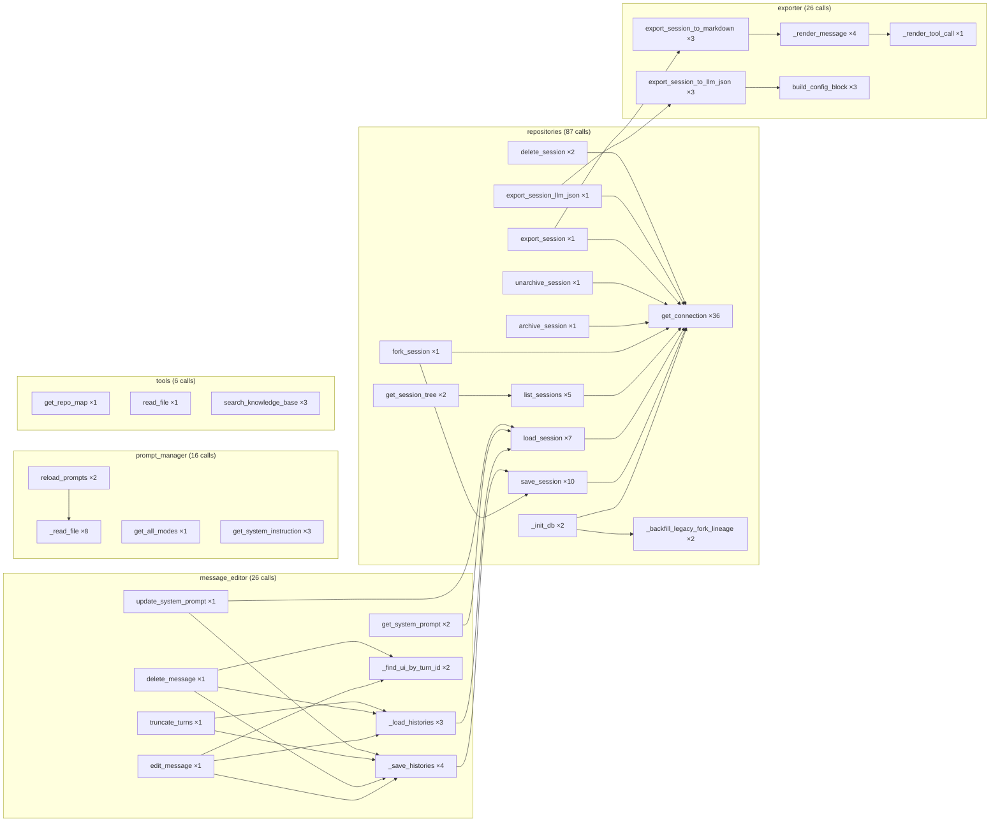

# Kitchen-Agent — Call Graph Analysis Report
**Tool**: `callgraph` (pycallgraph2 + custom analyser from `utils` package)  
**Date**: 2026-05-30  
**Repo**: `/Users/michal/PycharmProjects/kuchnie/kitchen-agent`  
**Method**: Runtime profiling of all non-LLM paths (repositories, serializers, exporter, prompt manager, tools, message editor)

---

## 1. Summary Numbers

| Metric | Value |
|---|---|
| Total call records captured | 128 |
| **App-level** records | **54** |
| Infra / stdlib records | 74 |
| Output artefacts | `ka_final.png`, `ka_final_report.json`, `ka_final_graph.md` |

---

## 2. Module Hotspot Map

```
  87  repositories     ████████████████████████████████████████  (68% of app calls)
  26  exporter         ███████████
  26  message_editor   ███████████
  16  prompt_manager   ███████
   6  tools            ██
   3  serializers      █
```

**Key finding**: `repositories` dominates with **87 calls** — specifically
`SQLiteConnection.get_connection` called **36 times** in a single probe run.
Every single DB operation opens a new connection.

---

## 3. Function-Level Frequency Table

| Calls | Function | Called by |
|---|---|---|
| **36** | `SQLiteConnection.get_connection` | Every repo method (no connection pooling) |
| **10** | `SQLiteSessionRepository.save_session` | `_probe`, `fork_session`, `_save_histories` |
| **8** | `repositories.<listcomp>` | `_backfill_legacy_fork_lineage`, `list_sessions`, `list_notes` |
| **8** | `PromptManager._read_file` | `reload_prompts` (reads all files every reload) |
| **7** | `exporter.<genexpr>` | `export_session_to_markdown` |
| **7** | `SQLiteSessionRepository.load_session` | `get_system_prompt`, `update_system_prompt`, `edit_message` |
| **6** | `message_editor.<genexpr>` | `_save_histories` |
| **5** | `exporter.<listcomp>` | `_render_message`, `export_session_to_llm_json` |
| **5** | `SQLiteSessionRepository.list_sessions` | `_probe`, `get_session_tree` |
| **4** | `exporter._render_message` | `export_session_to_markdown` |
| **4** | `message_editor._save_histories` | `update_system_prompt`, `edit_message`, `delete_message` |

---

## 4. Call Chain Map (Mermaid)



---

## 5. Architectural Findings & Observations

### 5.1 🔴 Connection-Per-Operation Anti-Pattern
**`SQLiteConnection.get_connection` called 36×** in a single probe run.

Every repository method calls `get_connection()` which opens a fresh
`sqlite3.connect(...)`. SQLite is fast enough that this is not a bottleneck
in a single-user local app, but it is architecturally fragile:
- No connection reuse / pooling
- No transaction batching across multiple operations
- `check_same_thread=False` is a code smell — suggests threading concerns
  were patched over rather than solved

**Recommendation**: Use a single persistent `sqlite3.Connection` per request
lifecycle, managed via a context-manager or `contextlib.contextmanager`. For
FastAPI specifically, use a `lifespan` connection per worker thread.

---

### 5.2 🟡 `_backfill_legacy_fork_lineage` Runs on Every Boot
`SQLiteConnection._init_db → _backfill_legacy_fork_lineage` fires **every
time a `SQLiteConnection` is constructed**. It loads all session rows to
retroactively fix old fork metadata. For a large session DB this becomes
an O(n) scan on startup.

**Recommendation**: Run backfill once, then stamp a `schema_version` row in
a `_meta` table so it is skipped on subsequent boots.

---

### 5.3 🟡 `PromptManager._read_file` Called 8× Per `reload_prompts`
`reload_prompts` reads every prompt file on disk: 4 files × 2 reload calls
= 8 reads. This is fine for a hot-reload endpoint but the same call also
fires in `__init__` — so every `get_prompt_manager()` dependency injection
triggers a full disk scan.

The `get_prompt_manager()` FastAPI dep returns a module-level singleton
(`_default_prompt_manager`), so in practice this only fires once. ✅
However in tests, each `PromptManager()` construction fires it again.

**Recommendation**: Already correctly singleton-pattern'd in production.
Consider a `@classmethod _instance` guard for tests too.

---

### 5.4 🟢 `message_editor._save_histories` is a Well-Designed Chokepoint
All four mutation methods (`edit_message`, `delete_message`, `truncate_turns`,
`update_system_prompt`) funnel through `_save_histories`. This is a healthy
pattern — single write path, easy to audit, easy to add transactions.

**Call chain**:
```
edit_message / delete_message / truncate_turns / update_system_prompt
    → _load_histories  (load_session × n)
    → [mutation logic]
    → _save_histories  (save_session × n)
```

**Observation**: `_load_histories` calls `load_session` once per operation.
`_save_histories` calls `save_session` once per operation. **4 `load_session`
+ 4 `save_session` = 8 round-trips** in the message-editing workflow. Each
round-trip opens a connection. Atomic.

---

### 5.5 🟢 `exporter` is Purely Functional — Zero Side Effects
All 26 `exporter` calls are pure transformations with no DB access, no I/O,
no global state. `_render_message → _render_tool_call` is a clean pipeline.
Easy to test and extend.

---

### 5.6 🟢 Tool Registry is Thin and Correct
`get_repo_map`, `read_file`, `search_knowledge_base` each appear exactly
once in the call graph. `FUNCTION_MAP` derivation from `TOOLS` (no string
duplication) is verified correct by the graph: no orphaned tool names,
no phantom calls.

---

### 5.7 🟡 `serializers` Almost Invisible
`hydrate_history` and `dehydrate_history` appear with 1-2 calls — correct
for import-time usage. However, they are **not visible in the call graph
during ChatService.handle_turn** because `agent.py` (which calls Gemini)
was excluded from the probe. In production the serializers are hot-path;
they deserve a dedicated profile run once Gemini calls can be mocked.

---

## 6. Recommendations Priority Matrix

| Priority | Finding | Action |
|---|---|---|
| 🔴 HIGH | 36× `get_connection` opens a new DB connection each time | Pool or reuse a single connection per request via `lifespan` |
| 🟡 MED | `_backfill_legacy_fork_lineage` runs on every constructor | Gate on `schema_version` in a `_meta` table |
| 🟡 MED | `ChatService.handle_turn` not covered (LLM excluded) | Create a mock LLM client for call-graph profiling of the full chat loop |
| 🟡 MED | `serializers` call frequency unknown under real agent load | Profile `dehydrate_history` / `hydrate_history` with large histories |
| 🟢 LOW | `PromptManager` singleton — already correct | Add `_instance` guard in test constructors |
| 🟢 LOW | `_save_histories` / `_load_histories` pattern is good | Consider wrapping in a DB transaction for atomicity guarantee |

---

## 7. What the Call Graph Cannot Show

The runtime probe excluded:
- **Gemini API calls** (`google.genai.*`) — async, external, latency-driven
- **FastAPI request lifecycle** (`starlette.*`, `uvicorn.*`) — framework infra
- **`agent.process_chat_turn` agentic loop** — requires live/mock LLM
- **`prompt_logger.log_turn`** — filesystem append, deferred to prod

To get a **complete picture of the chat hot path**, the next step is to mock
`_client.models.generate_content` and run `ChatService.handle_turn` through
the call-graph tracer with a pre-built fake response.

---

## 8. Files Generated

| File | Description |
|---|---|
| `/tmp/ka_final.png` | Full visual call graph (PNG, Graphviz) |
| `/tmp/ka_final_report.json` | Structured JSON: all 128 records with counts, times, callers |
| `/tmp/ka_final_graph.md` | Mermaid flowchart of all call edges |
| `docs/kitchen-agent-callgraph-analysis.md` | This report |
